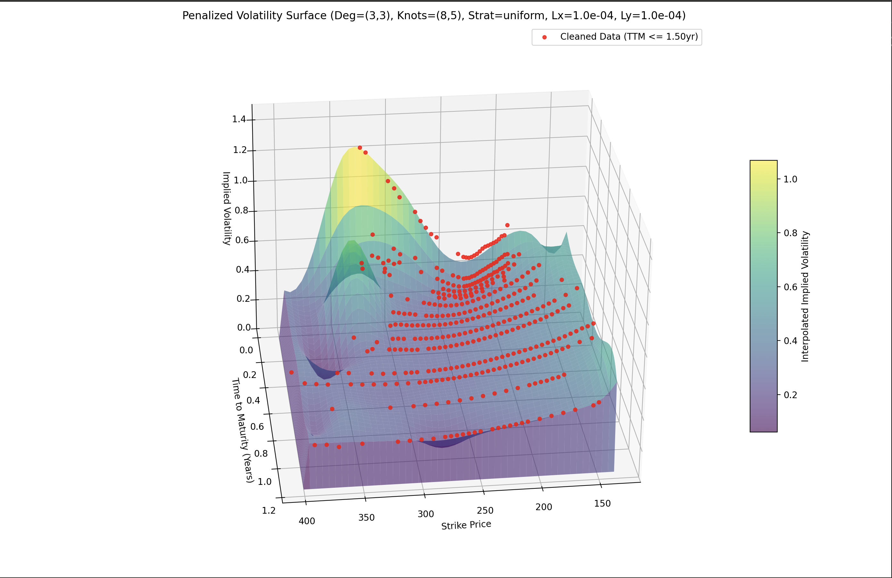
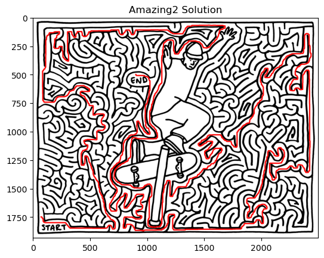

# Sebastian Conway-Burt | Aspiring Quantitative Researcher

A dedicated and analytically-driven professional with a strong foundation in computational mathematics, eager to apply expertise in software development, data analysis, and numerical methods to complex challenges. Proven ability to diagnose and improve AI model performance, lead technical projects, and implement robust numerical pipelines.

## Skills

* **Programming Languages:** C++, Python, MATLAB, SQL, Excel
* **Version Control:** Git
* **Analytics:** Numerical Analysis, Real Analysis, Predictive Analytics, Statistical Modeling, Time Series Modeling
* **Relevant Coursework:**
    * **Mathematics:** Differential Equations, Real Analysis, Multivariate Calculus, Probability and Statistics, Intermediate Numerical Analysis, Optimization Theory, Linear Algebra, Algorithms, Discrete Math.
    * **Other:** Data Structures, Accounting, Financial Management, Financial Analytics, Business Analytics, Operations Research, Intermediate Economic Theory, Portfolio Optimization Theory, Econometrics.

## Featured Projects

Here are some of my significant projects, showcasing my abilities in numerical analysis, AI development, and data structures:

### 1. P-Spline Volatility Surface Modeling
**Description:** Implemented and evaluated a robust multi-stage numerical pipeline in Python to construct and analyze implied volatility surfaces from real market data for over 100 assets. Conducted numerical experimentation regarding P-spline regularization and its affect on model accuracy, visual plausibility, smoothness, and efficiency.
**Key Technologies/Skills:** Python, NumPy, P-splines, Implied Volatility, Numerical Analysis, Data Analysis.
**[View Project Details](./Projects/numerical_analysis_project/README.md)**

### 2. EDU-Copilot
**Description:** Directed a team of six in developing a business plan for an AI-driven academic advising tool. Designed and evaluated AI-generated responses, gaining hands-on experience with prompt engineering, output analysis, and refining model accuracy. Developed a structured graph-based data model to represent course dependencies.
**Key Technologies/Skills:** AI Models, Prompt Engineering, Graph Data Models, Business Strategy, Project Leadership.
**[View Project Details](./Projects/edu_copilot_project/README.md)**

### 3. Maze Solver using Dijkstra's Algorithm
**Description:** Developed a Python-based maze solver that navigates complex mazes represented as images. This project leverages Dijkstra's algorithm to find the shortest path, where pixel color differences define edge weights, demonstrating graph traversal and image processing techniques.
**Key Technologies/Skills:** Python, NumPy, OpenCV, Dijkstra's Algorithm, Graph Theory, Image Processing.
**[View Project Details](./Projects/maze_dijkstra_solver/README.md)**

---

## Coursework

Explore my academic assignments, organized by course, to see a broader range of my work in specific areas.

* **[Numerical Analysis Coursework](./Coursework/numerical_analysis/README.md)**
* **[Algorithms Coursework](./Coursework/algorithms/README.md)**
* **[Data Structures Coursework](./Coursework/data_structures/README.md)**

---

## Contact

* **Email:** sconwayburt@gmail.com
* **LinkedIn:** [https://www.linkedin.com/in/sebastian-conway-burt/](https://www.linkedin.com/in/sebastian-conway-burt/)
